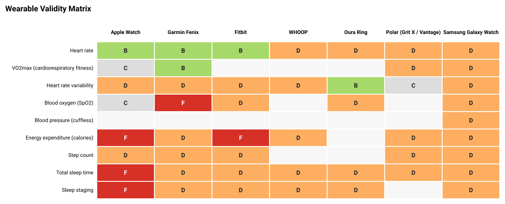

# Wearable Validity Atlas

**An auditable, living reference for how accurate consumer wearables actually are — and how much of what they market has ever been independently validated.**

Consumer wearables now make dozens of physiological claims — VO₂max, HRV, SpO₂, sleep stages, recovery, cuffless blood pressure, calorie burn. The validation literature behind those claims is scattered across hundreds of journal articles that report agreement in mutually incompatible ways, and the existing syntheses are annual PDFs organized for academics. This project turns that literature into a **queryable, versioned, fully-auditable grade matrix** — where every verdict is *computed* from study-level data by transparent code, not asserted.

> The organizing finding: **wearables tend to be best validated for the metrics nobody buys them for (resting HR, steps) and least validated for the metrics they're marketed on (recovery scores, cuffless BP, calorie burn).** The Atlas makes that asymmetry legible at a glance.



*Grades are generated by `python -m wearvalid build` from the data in [`data/`](data/). The grid above is the current seed corpus.*

### ▶ Play with it

There's a **self-contained interactive version** at [`docs/index.html`](docs/index.html) — an explorable grade matrix with click-through audit trails (every verdict + the studies behind it), live search, grade filtering, and a methodology explainer. Open the file directly in a browser, or serve it:

```bash
python -m http.server --directory docs    # → http://localhost:8000
```

The data is embedded at build time, so it works offline and deploys as-is to **GitHub Pages** (Settings → Pages → branch `main`, folder `/docs`).

---

## Why this exists / why it's different

| | Existing reviews | Wearable Validity Atlas |
|---|---|---|
| **Format** | Static PDF | Queryable matrix + machine-readable CSV |
| **Verdicts** | Narrative, per-metric | One **computed letter grade** per device × claim |
| **Auditability** | Read the prose | Every grade ships with its evidence + a deterministic rationale |
| **Common axis** | None — units differ per metric | **Resolution Ratio** (error ÷ smallest worthwhile change) |
| **Marketed-but-unvalidated** | Invisible | First-class **Grade D** |
| **Proprietary scores** | Graded as if measurable | **Grade N** — flagged as category-error to validate |
| **Update model** | Annual | Add a YAML file, rebuild |

The methodology is native to exercise physiology — *trueness vs. precision*,
*smallest worthwhile change*, *criterion ceilings* — concepts the consumer-wearable
discourse has never imported. Full spec: **[METHODOLOGY.md](METHODOLOGY.md)**.

---

## The grading scale

| Grade | Meaning |
|:---:|---|
| 🟢 **A** | Established valid — consistent good agreement on strong, decomposable evidence |
| 🟡 **B** | Conditionally valid, or good but thinly/lossily evidenced |
| ⚪ **C** | Contested / insufficient evidence |
| 🟠 **D** | **Unvalidated but marketed** — claim made, no independent study in the corpus |
| 🔴 **F** | Refuted — error exceeds the usability threshold on adequate evidence |
| ⚫ **N** | **Not validatable** — proprietary composite with no external criterion |

See the live results and the per-cell audit trail in **[build/MATRIX.md](build/MATRIX.md)**.

---

## How a grade is computed

```
study YAML (data/studies/)
        │
        ▼
Layer 1 — normalize.py        reduce every reported statistic
        │                     (Bland-Altman / RMSE / MAPE / ICC / CCC …)
        │                     to {bias, precision, agreement} + a fidelity flag
        │                     · correlation-only evidence is rejected outright
        ▼
Layer 2 — grade.py            Resolution Ratio R = precision / SWC   (data/swc.yaml)
        │                     → tier (good / moderate / poor)
        │                     → deterministic letter grade + plain-language rationale
        ▼
build.py → build/MATRIX.md · matrix.csv · heatmap.svg
```

Two design commitments make it trustworthy:

- **Lossy inputs can't reach A.** A grade resting only on MAPE or "% within band"
  is capped at B — a single conflated statistic can't prove both trueness *and* precision.
- **A device can't beat its criterion.** Each metric records the reference
  method's own error (e.g. CPET test–retest ≈ 3–4 %), so devices are graded
  against what's achievable.

---

## Quickstart

```bash
git clone <this-repo> && cd wearable-validity-atlas
pip install -e .

python -m wearvalid build     # regenerate the matrix, CSV, and heatmap
pytest                        # verify the conversion + grading math (14 tests)
```

To **contest a verdict or add evidence**: drop a YAML file in
[`data/studies/`](data/studies/) or adjust a threshold in
[`data/swc.yaml`](data/swc.yaml), then rebuild. The diff in `build/MATRIX.md`
shows exactly how your change propagated — that traceability *is* the point.

### A study file looks like this

```yaml
id: sensors_mdpi2025
citation: "Validation of consumer wearables… MDPI Sensors 2025;25(1):275."
url: https://www.mdpi.com/1424-8220/25/1/275
tier: primary
independent: true
measurements:
  - device: garmin_fenix
    claim: spo2
    criterion: co_oximetry
    reported: { ccc: 0.10 }     # → Grade F (essentially no agreement vs gold standard)
```

---

## Repository layout

```
data/
  swc.yaml            smallest-worthwhile-change anchors + criterion ceilings (the editorial calls)
  claims.yaml         catalogue of claims; which are validatable vs proprietary composites
  devices.yaml        devices and the claims each one markets (drives Grade D)
  studies/*.yaml      the evidence corpus — one file per study
src/wearvalid/
  normalize.py        Layer 1: statistical normalization
  grade.py            Layer 2: Resolution Ratio + deterministic grading
  build.py            orchestration + Markdown/CSV rendering
  heatmap.py          dependency-free SVG heatmap
tests/                conversion-math and grading-logic tests
build/                generated artifacts (committed — they are the published output)
METHODOLOGY.md        the citable specification
```

---

## Status & roadmap

v0.1 ships a small, **illustrative** seed corpus to prove the engine end-to-end.
A **Grade D** means "no study in *this corpus* yet," not "no study exists." Next:

- [ ] Expand the corpus toward the ~249 studies catalogued in the umbrella review
- [ ] Add construct/predictive-validity tracking for the **N** composite scores
- [ ] Per-condition grades (rest vs. high-intensity; skin-tone moderation for PPG)
- [ ] Static site with filterable matrix + per-cell citations

---

## Author

Built by **Jack Mislinski** — exercise physiologist (MSc) with hands-on
criterion-validation experience (CPET / metabolic-cart vs. Douglas-bag
validation). The Atlas applies clinical measurement-science standards to the
consumer wearable field, from someone who has actually run the reference methods.

## License

[MIT](LICENSE). Contributions and challenges to any grade are welcome — open a PR
against the data or the thresholds.
